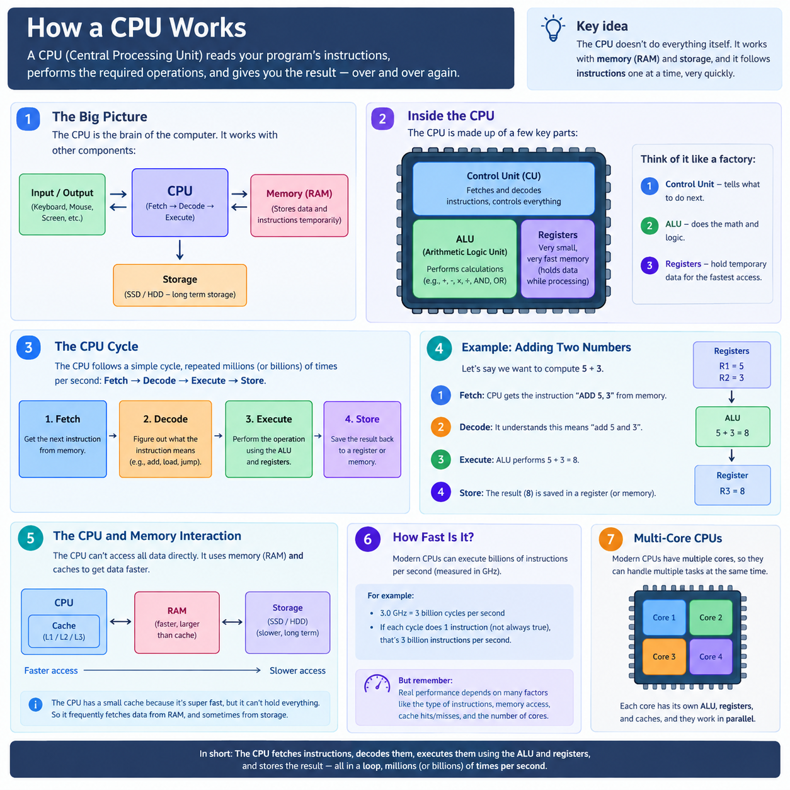
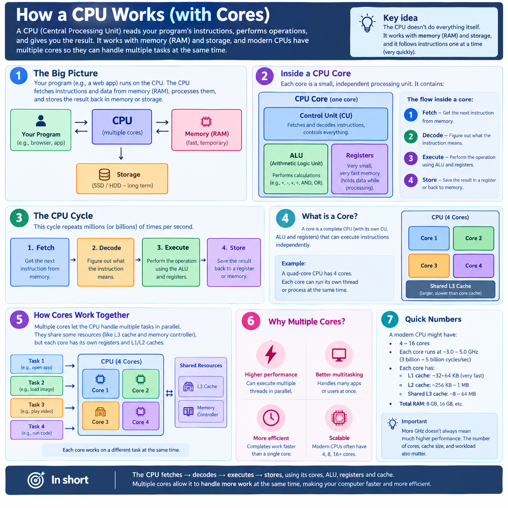

# What is back of the envelope estimation?
- Back of the envelope estimation is used to estimate the amount of traffic, storage, Ram and computing power is needed to build the efficient and effective system.
- Calculation we should know:
1. 1 KB = 1000 bits = 10^3
2. 1 MB = 1000000 bits = 10^6
3. 1 GB = 1000000000 bits = 10^9
4. 1 TB = 1000000000000 bits = 10^12
5. 1 PB = 1000000000000000 bits = 10^15

- In this we take estimation to make our calculation easy.
- Estimation we should made are:
1. Load estimation
2. Storage estimation
3. Resource estimation.

- Twitter for example have 100 million users.
1. Load estimation:
- 100 million users make 10 wirte request and 1000 read req per day.
- 100 million * 10 - 1 billion write request.
- 100 million * 1000 - 100 billion read request.

2. Storage estimation:
- 100 million users post 10 tweets every day out of which 10 percent are media.
- text tweet size 500 char = 500 Bytes = Approx 1000 bytes -> 1000 bytes * 900 million -> 10 ^12 = 1 TB
- Image tweet size = 2MB -> 100 million * 10*10^6 = 10^15 = 1 PB
- 1 PB of storage is need per day.

3. Reource Estimation.
- Lets say there re 1 billion req per day.
- Resquest per second = 1 billion / 1 lakh  = 10^9/10^5 = 10^4 = 10000 RPS
- 1 req takes 10 ms of proccesing time to complete.
- 10000 RPS * 10 = 100,000 ms of processing is needed per second.
- 1 core of CPU can handle 1000ms of proccesing per second.
- Number of cores need = 100,000/1000 = 100 cores
- 1CPU = 4 core
- Number of CPU needed is 100/4 = 25

